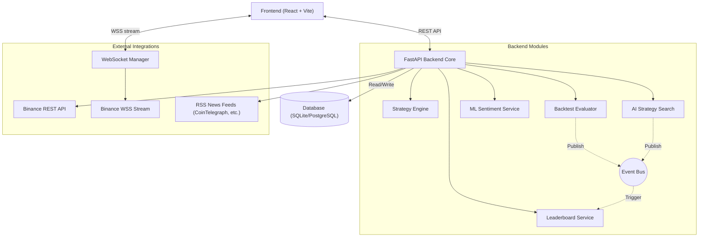

# Crypto Strategy Lab

Crypto Strategy Lab is a professional-grade platform designed for automated cryptocurrency trading strategy discovery, backtesting, and sentiment analysis. 

Built with an extensible architecture, it enables quants, developers, and crypto enthusiasts to seamlessly evaluate complex multi-timeframe strategies against historical Binance market data and live market conditions.

## Project Overview

The core objective of the Crypto Strategy Lab is to provide a unified environment for:
1. **Algorithmic Strategy Creation**: A plug-and-play architecture for writing and testing algorithms.
2. **Strategy Composition**: Combining multiple algorithms using Boolean logic (AND/OR) or Weighted scoring.
3. **Automated AI Search**: A powerful random search engine to discover optimal parameter sets over thousands of combinations.
4. **NLP Sentiment Integration**: Deep learning-based parsing of live financial news into actionable trading signals.
5. **Real-time Live Data**: WebSockets multiplexing for high-performance chart rendering.

## Architecture



## Technology Stack

- **Backend:** Python, FastAPI, SQLAlchemy, Pydantic, Uvicorn.
- **Frontend:** TypeScript, React, Vite, Tailwind CSS, Lucide Icons, lightweight-charts.
- **Machine Learning:** HuggingFace `transformers` (FinBERT), `TextBlob`, `torch`.
- **Data Integrations:** `ccxt`, `feedparser`, `websockets`.

## Installation Guide

### Backend Setup

1. **Navigate to the backend directory:**
   ```bash
   cd backend
   ```

2. **Create a Python Virtual Environment:**
   ```bash
   python -m venv venv
   # On Windows:
   venv\Scripts\activate
   # On Mac/Linux:
   source venv/bin/activate
   ```

3. **Install Dependencies:**
   ```bash
   pip install -r requirements.txt
   ```

4. **Run the Server:**
   ```bash
   uvicorn src.main:app --reload --port 8000
   ```

### Frontend Setup

1. **Navigate to the frontend directory:**
   ```bash
   cd frontend
   ```

2. **Install Node Dependencies:**
   ```bash
   npm install
   ```

3. **Start the Development Server:**
   ```bash
   npm run dev
   ```

## Configuration

Currently, the application runs via standard environment variables and sensible defaults:
- `DATABASE_URL`: Set to `sqlite:///./crypto_lab.db` by default. Can be overridden for PostgreSQL.
- **Binance API**: By default, it connects to public, unauthenticated Binance endpoints for historical and live WS data.

## API Documentation

FastAPI provides an automatic, interactive API documentation interface.
Once the backend is running, navigate to:
- **Swagger UI:** `http://localhost:8000/docs`
- **ReDoc:** `http://localhost:8000/redoc`

### Core Endpoints Summary:
- `GET /api/v1/market/ohlcv`: Fetch historical candles.
- `GET /api/v1/strategies`: List loaded strategies.
- `POST /api/v1/backtest/run`: Trigger a strategy evaluation.
- `GET /api/v1/search/random`: Trigger AI Parameter discovery.
- `GET /api/v1/leaderboard`: View top performing configurations.
- `GET /api/v1/news`: Fetch aggregated crypto news.
- `GET /api/v1/sentiment/summary`: Fetch NLP analysis summary.
- `WS /ws/events`: System-wide event broadcasting.
- `WS /ws/market`: Live Binance WSS Multiplexer.

## Demo / Screenshots

*(Screenshots placeholder - System Dashboard, Trade Metrics, and AI Sentiment analysis will be displayed here)*
