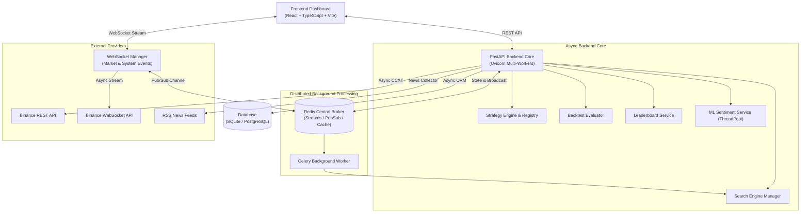

# Crypto Strategy Lab – Platform Phân Tích & Đánh Giá Chiến Lược Giao Dịch Crypto

Crypto Strategy Lab là một nền tảng phân tích, kết hợp, backtesting và tự động tìm kiếm chiến lược giao dịch tiền mã hóa với kiến trúc phần mềm bất đồng bộ, mở rộng (Plugin Architecture), hỗ trợ đa tiến trình (Multi-worker compatible) và tích hợp tin tức NLP (Sentiment Analysis).

---

## 📌 Các Tính Năng Chính (Key Features)

1. **Real-time Market Data & Multi-Timeframe Chart**:
   - Tích hợp Binance API bất đồng bộ (`ccxt.async_support.binance`) lấy dữ liệu nến (OHLCV).
   - WebSocket multiplexer truyền dữ liệu thời gian thực cho tối đa 4 biểu đồ với các timeframe độc lập (1m, 5m, 15m, 1h, 4h, 1d).
2. **Strategy Engine & Plugin Architecture**:
   - Kiến trúc mở rộng dạng Plugin cho phép bổ sung chiến lược đơn lẻ (`MAStrategy`, `RSIStrategy`, `BollingerBandsStrategy`, `SupportResistanceStrategy`, `SMCStrategy`, `NewsSentimentStrategy`) qua `StrategyRegistry` mà không cần sửa core engine.
3. **Composite Strategy**:
   - Kết hợp các chiến lược đơn lẻ bằng quy tắc Logic (`AND`, `OR`) hoặc phương pháp trọng số (`WEIGHTED`).
4. **Strategy Search Engine & Continuous Loop**:
   - Tự động tìm kiếm tổ hợp chiến lược tối ưu bằng thuật toán **Random Search** hoặc **Genetic Search (Giải thuật Di truyền)**.
   - Chạy vòng lặp ngầm liên tục (**Continuous Strategy Loop**) tìm kiếm chiến lược vượt trội với Stop Condition tùy biến (max iterations, time limit, no improvement threshold).
5. **Backtesting & Leaderboard Engine**:
   - Giả lập giao dịch trên dữ liệu lịch sử, tính toán chỉ số hiệu năng: Total Return, Win Rate, Max Drawdown (MDD), Profit Factor, Sharpe Ratio.
   - Bảng xếp hạng **Leaderboard (Top-K)** cập nhật tự động qua Pub/Sub Event Bus.
6. **News Crawler & Sentiment Analysis Pipeline**:
   - Thu thập tin tức RSS (`NewsCollector`, `RSSNewsProvider`) và phân tích cảm xúc (Sentiment) bằng mô hình Machine Learning FinBERT/TextBlob trong background threadpool, sử dụng kết quả sentiment làm tín hiệu chiến lược giao dịch.

---

## 🏛️ Sơ Đồ Kiến Trúc Hệ Thống (Software Architecture)



---

## ⚡ Giải Quyết Các Vấn Đề Kiến Trúc (Architectural Drivers & Quality Attributes)

| Vấn đề Kiến trúc | Giải pháp Thực thi |
| :--- | :--- |
| **Modifiability (Khả năng mở rộng)** | **Plugin Architecture & StrategyRegistry**: Đăng ký chiến lược mới mà không cần chỉnh sửa các component Controller, Backtester hay Leaderboard. |
| **Scalability & Multiprocessing** | **Offloading to Celery & Redis**: Offload công việc tính toán di truyền kéo dài sang Celery Worker. Loại bỏ biến RAM toàn cục (`global`) giúp chạy an toàn trên `--workers N`. |
| **Non-blocking Event Loop** | **Async CCXT & ThreadPool Execution**: Chuyển BinanceAdapter sang `ccxt.async_support.binance`. Đẩy tính toán Pandas và PyTorch ML sang ThreadPool qua `asyncio.to_thread`. |
| **Reliability & Event Decoupling** | **Redis EventBus**: Sử dụng Pub/Sub và Consumer Groups báo nhận (Ack/Nack) để phân phối sự kiện giữa các micro-services / workers. |
| **Maintainability** | Strategy Search được thiết kế độc lập với Backtesting Implementation qua `StrategyCandidate` abstraction. |

---

## 🛠️ Hướng Dẫn Cài Đặt & Chạy Hệ Thống (Installation & Running Guide)

### 1. Yêu Cầu Tiền Đề (Prerequisites)
- **Python**: `>= 3.10`
- **Node.js**: `>= 18.x`
- **Redis Server** (Tùy chọn cho multi-worker pub/sub):
  ```bash
  docker run -d --name redis-broker -p 6379:6379 redis:7-alpine
  ```

### 2. Backend Setup
```bash
# Di chuyển vào thư mục backend
cd backend

# Tạo và kích hoạt môi trường ảo Python
python -m venv venv

# On Windows:
venv\Scripts\activate
# On Linux/Mac:
source venv/bin/activate

# Cài đặt các thư viện phụ thuộc
pip install -r requirements.txt

# Chạy server FastAPI
uvicorn src.main:app --reload --port 8000
```

*Chạy Celery Worker (Nếu cần chạy tác vụ ngầm quy mô lớn):*
```bash
celery -A src.services.search.celery_app.celery_app worker --loglevel=info
```

### 3. Frontend Setup
```bash
# Di chuyển vào thư mục frontend
cd frontend

# Cài đặt packages
npm install

# Khởi chạy server phát triển
npm run dev
```

---

## 🧪 Chạy Kiểm Thử (Running Test Suite)

Hệ thống đi kèm với test suite tự động kiểm tra toàn bộ API endpoints, Composite Strategy và Backtest Evaluator:

```bash
# Tại thư mục gốc dự án:
$env:PYTHONPATH="backend"; pytest backend/src/tests/test_main_api.py backend/src/strategies/test_composite.py backend/src/services/backtest/test_evaluator.py
```

---

## 📋 Tài Liệu API & WebSocket Endpoints

Truy cập Swagger UI tự động khi ứng dụng đang chạy tại: `http://localhost:8000/docs`

- `GET /api/v1/market/ohlcv`: Lấy nến lịch sử từ Binance.
- `GET /api/v1/strategies`: Lấy danh sách chiến lược hiện có và tham số mặc định.
- `POST /api/v1/backtest/run`: Thực hiện backtest đơn lẻ hoặc composite strategy.
- `POST /api/v1/backtest/run-with-trades`: Thực hiện backtest chi tiết bao gồm lịch sử vào/thoát lệnh và markers.
- `POST /api/v1/search/start`: Khởi chạy tìm kiếm tham số (Random Search / Genetic Algorithm).
- `GET /api/v1/search/status`: Kiểm tra tiến độ job tìm kiếm.
- `GET /api/v1/leaderboard`: Lấy Bảng xếp hạng Top-K chiến lược.
- `GET /api/v1/news`: Lấy tin tức tổng hợp thị trường crypto.
- `GET /api/v1/sentiment/summary`: Phân tích cảm xúc tin tức thị trường NLP.
- `WS /ws/market`: Stream nến giá realtime từ Binance.
- `WS /ws/events`: Broadcast sự kiện toàn hệ thống (Leaderboard update).
