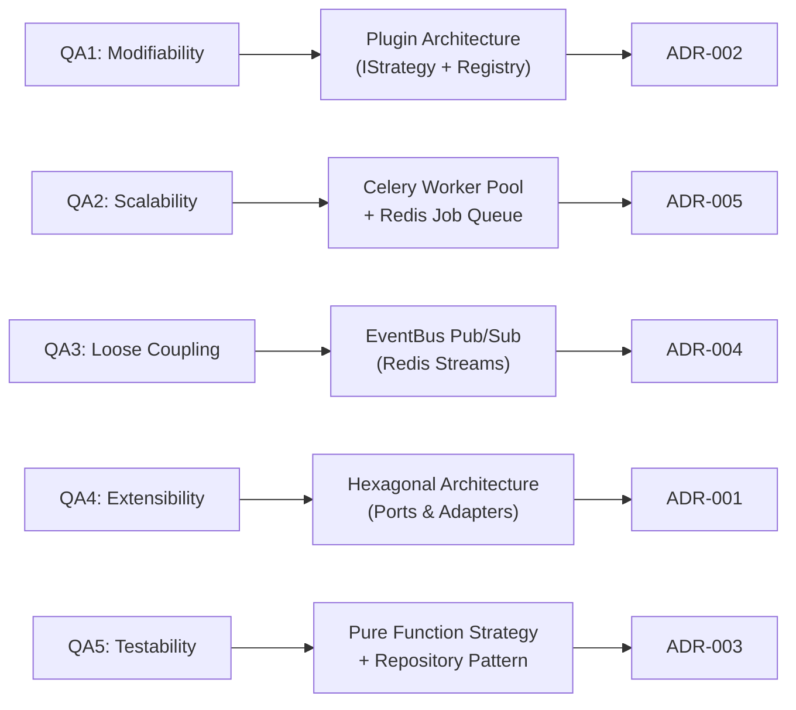
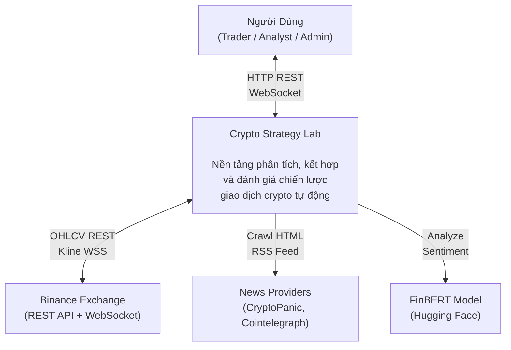
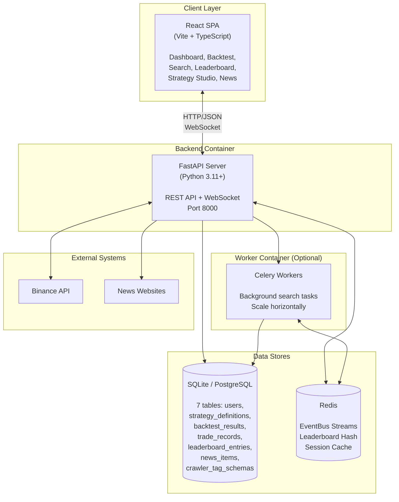
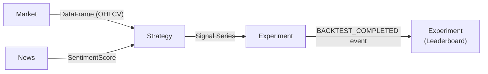
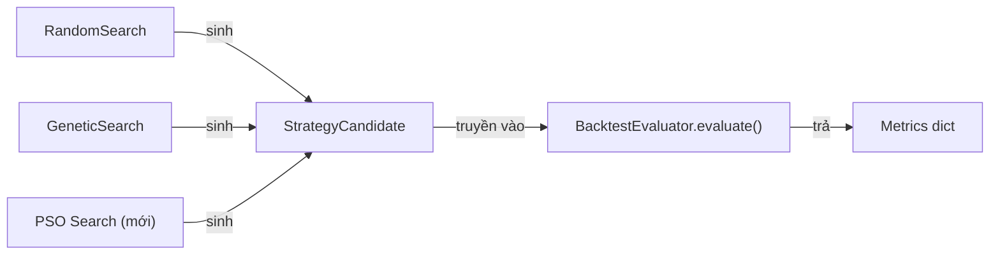
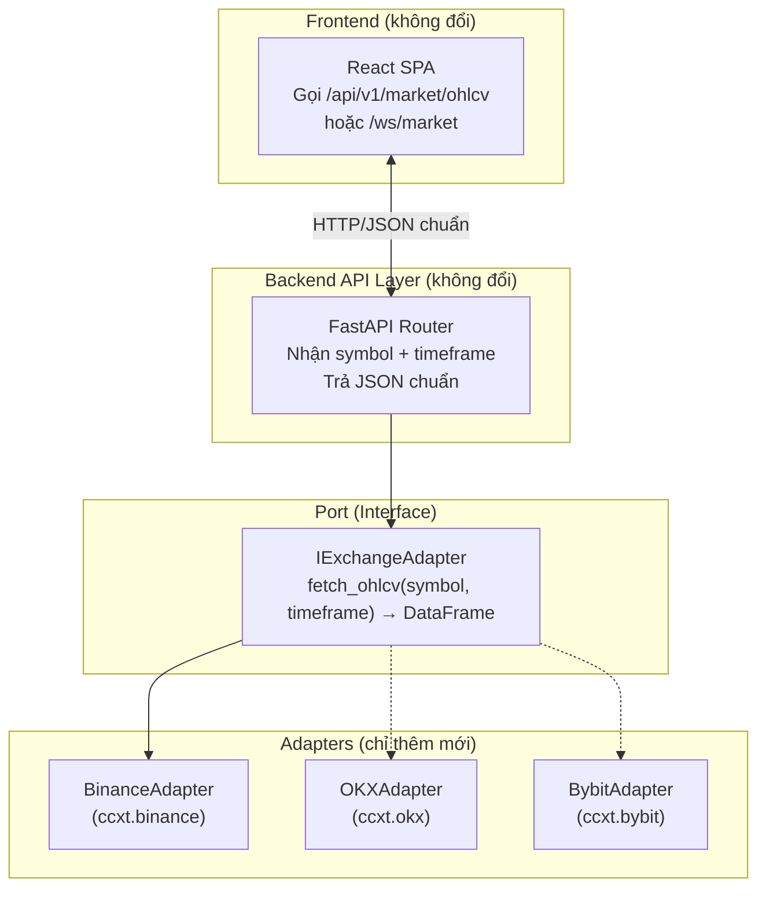
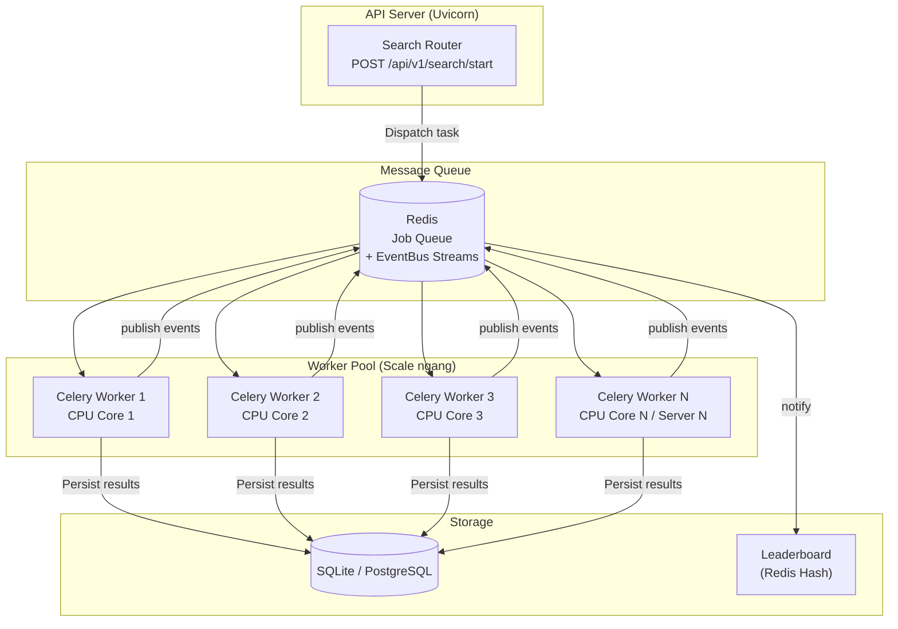
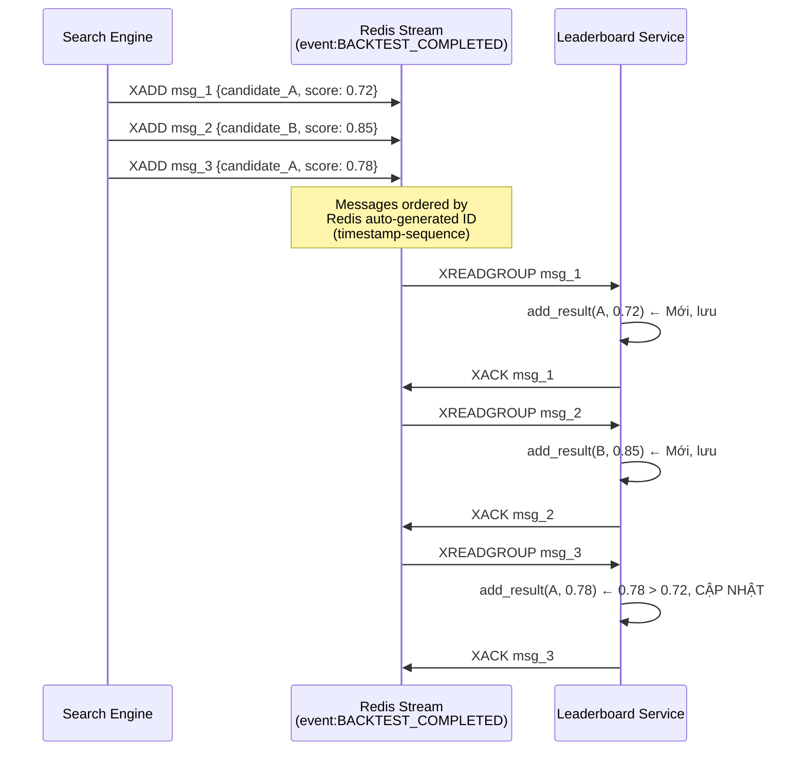
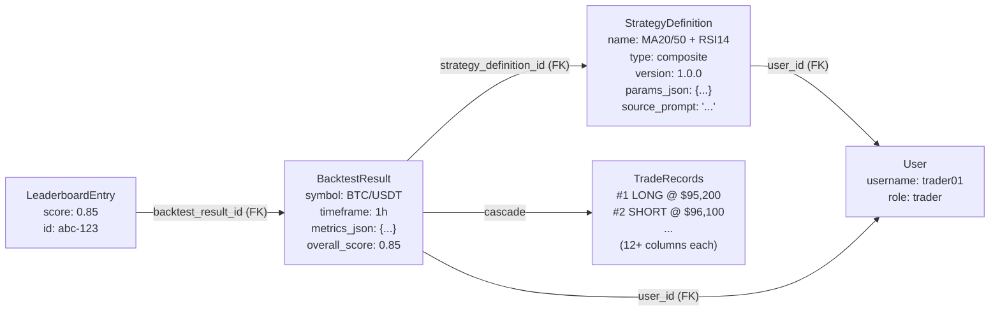

# Trả Lời 10 Câu Hỏi Kiến Trúc – Checklist Bảo Vệ Đồ Án
## Crypto Strategy Lab – Kiến Trúc Phần Mềm

> **Mục tiêu**: Trả lời triệt để 10 câu hỏi kiểm tra kiến trúc (slide 39 – "Checklist sinh viên phải trả lời được 10 câu này") bằng **bằng chứng code thực tế**, diagram minh họa, và truy vết file cụ thể trong hệ thống.

---

## Câu 1: Architectural Drivers là gì?

**Architectural Drivers** (các yếu tố quyết định kiến trúc) của hệ thống Crypto Strategy Lab bao gồm:

### 1.1. Functional Drivers (Yêu cầu chức năng chính)
| # | Driver | Mô tả |
|:--|:-------|:------|
| F1 | **Multi-Strategy Backtest** | Người dùng chọn 1–3 chỉ báo kỹ thuật (MA, RSI, BB, SR, SMC, Sentiment), kết hợp theo logic AND/OR/WEIGHTED, và chạy backtest trên dữ liệu lịch sử |
| F2 | **Automated Strategy Search** | Hệ thống tự động tìm kiếm tổ hợp chiến lược tối ưu bằng Random Search hoặc Genetic Algorithm |
| F3 | **Real-time Market Monitoring** | Hiển thị đồng thời 4 biểu đồ nến thời gian thực từ Binance WebSocket |
| F4 | **NLP Strategy Generation** | Chuyển đổi mô tả ngôn ngữ tự nhiên thành cấu hình chiến lược JSON có thể thực thi |
| F5 | **News Sentiment Analysis** | Thu thập tin tức, phân tích cảm xúc bằng FinBERT, tích hợp vào chiến lược |

### 1.2. Quality Attribute Drivers (Thuộc tính chất lượng)
| # | Quality Attribute | Scenario cụ thể |
|:--|:-----------------|:-----------------|
| QA1 | **Modifiability** | Thêm strategy mới (MACD) trong < 30 phút, chỉ tạo 1 file, không sửa bất kỳ module nào khác |
| QA2 | **Scalability** | Scale từ 100 → 100.000 backtest bằng cách thêm Celery workers, không sửa code |
| QA3 | **Loose Coupling** | News Service lỗi không ảnh hưởng Market Dashboard. Search Engine lỗi không ảnh hưởng Backtest |
| QA4 | **Extensibility** | Thêm sàn OKX/Bybit chỉ cần implement `IExchangeAdapter`, Frontend không đổi |
| QA5 | **Testability** | Strategy là pure function (DataFrame → Signal Series), test đơn vị không cần DB/API |

### 1.3. Constraint Drivers (Ràng buộc)
- **Công nghệ**: Python FastAPI + React TypeScript + SQLite (dev) / PostgreSQL (prod)
- **Hạ tầng**: Phải chạy được trên local machine không cần Docker (zero-setup dev)
- **Dữ liệu bên ngoài**: Binance API rate limit, Cloudflare anti-bot trên news sites

### 1.4. Ánh xạ Driver → Quyết định kiến trúc



> **Tham khảo**: [ADR-001](adr/ADR-001.md) → [ADR-006](adr/ADR-006.md)

---

## Câu 2: C4 Context và Container của nhóm?

### 2.1. C4 Level 1 – System Context Diagram



**Actors chính:**
- **Người dùng** giao tiếp qua React SPA (HTTP + WebSocket).
- **Binance** cung cấp dữ liệu nến lịch sử và giá realtime.
- **News Providers** cung cấp tin tức crypto.
- **FinBERT** phân tích sentiment (chạy local hoặc API).

### 2.2. C4 Level 2 – Container Diagram



**Containers:**
| Container | Công nghệ | Trách nhiệm |
|:----------|:----------|:------------|
| **React SPA** | React 19 + Vite + TS | UI/UX, chart rendering, form submission |
| **FastAPI Server** | Python + FastAPI + Uvicorn | REST API, WebSocket, business logic |
| **Celery Workers** | Python + Celery | Background search tasks (scale-out) |
| **SQLite/PostgreSQL** | SQLAlchemy ORM | Persistent storage (7 tables) |
| **Redis** | Redis 7+ | EventBus Streams, Leaderboard cache |

---

## Câu 3: Boundary của Market / Strategy / Experiment / News?

Hệ thống được chia thành **4 Bounded Context** rõ ràng, mỗi context có ranh giới (boundary) riêng biệt:

```mermaid
graph TB
    subgraph " MARKET Context"
        direction TB
        M1["BinanceAdapter<br/>(infrastructure/adapters/)"]
        M2["BinanceWSAdapter<br/>(infrastructure/adapters/)"]
        M3["IExchangeAdapter<br/>(domain/interfaces.py)"]
        M4["Market WS Handler<br/>(api/websockets/market_ws.py)"]
        M5["OHLCV REST API<br/>(main.py: /api/v1/market/ohlcv)"]
    end
    
    subgraph " STRATEGY Context"
        direction TB
        S1["IStrategy Interface<br/>(domain/interfaces.py)"]
        S2["BaseStrategy<br/>(strategies/base.py)"]
        S3["StrategyRegistry<br/>(strategies/registry.py)"]
        S4["CompositeStrategy<br/>(strategies/composite.py)"]
        S5["6 Implementations<br/>(strategies/implementations/)"]
        S6["AIStrategyParser<br/>(services/ai/strategy_parser.py)"]
    end
    
    subgraph " EXPERIMENT Context"
        direction TB
        E1["BacktestEvaluator<br/>(services/backtest/evaluator.py)"]
        E2["TradeSimulator<br/>(services/backtest/trade_simulator.py)"]
        E3["RandomSearch<br/>(services/search/random_search.py)"]
        E4["GeneticSearch<br/>(services/search/genetic_search.py)"]
        E5["LeaderboardService<br/>(services/leaderboard/)"]
        E6["Celery Tasks<br/>(services/search/tasks.py)"]
    end
    
    subgraph " NEWS Context"
        direction TB
        N1["INewsProvider<br/>(domain/news_interfaces.py)"]
        N2["NewsCollector<br/>(services/news/news_collector.py)"]
        N3["SmartCrawler<br/>(services/crawler/smart_crawler.py)"]
        N4["SentimentService<br/>(services/ML/sentiment_service.py)"]
        N5["NewsSentimentStrategy<br/>(strategies/implementations/)"]
    end
```



### Bảng chi tiết Boundary

| Bounded Context | Thư mục chính | Interface biên | Input | Output |
|:---------------|:-------------|:--------------|:------|:-------|
| **Market** | `infrastructure/adapters/`, `api/websockets/` | `IExchangeAdapter` | Symbol + Timeframe | `pd.DataFrame` (OHLCV), WebSocket tick stream |
| **Strategy** | `domain/`, `strategies/`, `services/ai/` | `IStrategy` | `pd.DataFrame` + `params` | `pd.Series` (Signal: 1/0/-1), JSON Schema |
| **Experiment** | `services/backtest/`, `services/search/`, `services/leaderboard/` | EventBus events | Signal Series + OHLCV data | Metrics dict, Trade list, LeaderboardEntry |
| **News** | `services/news/`, `services/crawler/`, `services/ML/` | `INewsProvider` | URL hoặc query string | `NewsItem` + `SentimentResult(label, score)` |

### Giao tiếp giữa các Context



- **Market → Strategy**: Truyền DataFrame nến. Strategy không biết data đến từ Binance hay OKX.
- **Strategy → Experiment**: Truyền Signal Series. Experiment không biết signal được tạo bởi MA hay RSI.
- **News → Strategy**: `NewsSentimentStrategy` đọc sentiment score từ `SentimentService`. Nếu service lỗi → strategy fallback HOLD.
- **Experiment → Leaderboard**: Giao tiếp qua `EventBus.publish(BACKTEST_COMPLETED)`, **không gọi trực tiếp**.

---

## Câu 4: Thêm strategy mới sửa ở đâu?

### Trả lời: Chỉ cần tạo **1 file duy nhất** trong `strategies/implementations/`

**Ví dụ thêm chiến lược MACD:**

```python
# File: backend/src/strategies/implementations/macd_strategy.py  [MỚI]

from src.strategies.base import BaseStrategy
import pandas as pd
from typing import Dict, Any

class MACDStrategy(BaseStrategy):
    @property
    def id(self) -> str:
        return "macd"
    
    @property
    def name(self) -> str:
        return "MACD Crossover"
    
    @property
    def description(self) -> str:
        return "Buy when MACD crosses above Signal line"
    
    @property
    def default_params(self) -> Dict[str, Any]:
        return {"fast": 12, "slow": 26, "signal": 9}
    
    def generate_signals(self, data: pd.DataFrame, params: Dict[str, Any] = None) -> pd.Series:
        p = self.get_params(params)
        ema_fast = data['close'].ewm(span=p['fast']).mean()
        ema_slow = data['close'].ewm(span=p['slow']).mean()
        macd_line = ema_fast - ema_slow
        signal_line = macd_line.ewm(span=p['signal']).mean()
        
        signals = pd.Series(0, index=data.index)
        signals[macd_line > signal_line] = 1   # BUY
        signals[macd_line < signal_line] = -1  # SELL
        return signals
```

### Danh sách component KHÔNG cần sửa

| Component | File | Lý do không sửa |
|:----------|:-----|:----------------|
| StrategyRegistry | `strategies/registry.py` | Auto-discovery scan `implementations/` folder, tự nạp class mới |
| BacktestEvaluator | `services/backtest/evaluator.py` | Chỉ nhận `pd.Series` signals, không quan tâm nguồn gốc |
| TradeSimulator | `services/backtest/trade_simulator.py` | Chỉ nhận signals + OHLCV data |
| CompositeStrategy | `strategies/composite.py` | Gọi `child.generate_signals()` theo IStrategy interface |
| RandomSearch | `services/search/random_search.py` | Lấy strategy qua `registry.get_strategy(id)` |
| GeneticSearch | `services/search/genetic_search.py` | Kế thừa RandomSearch, cùng cơ chế |
| LeaderboardService | `services/leaderboard/` | Nhận metrics qua EventBus, không biết strategy nào |
| Frontend (tất cả pages) | `frontend/src/` | Gọi `GET /api/v1/strategies` để render danh sách động |
| EventBus | `infrastructure/message_broker/` | Transport layer, agnostic |

### Cơ chế Auto-Discovery (code thực tế)

```python
# registry.py – StrategyRegistry._load_strategies()
def _load_strategies(self):
    implementations_dir = os.path.join(os.path.dirname(__file__), 'implementations')
    for filename in os.listdir(implementations_dir):
        if filename.endswith(".py") and filename != "__init__.py":
            module = importlib.import_module(f"src.strategies.implementations.{filename[:-3]}")
            for name, obj in inspect.getmembers(module, inspect.isclass):
                if issubclass(obj, IStrategy) and not inspect.isabstract(obj):
                    instance = obj()
                    self.register(instance.id, obj)  # ← Tự đăng ký!
```

> **Kết luận**: Tính **Modifiability** đạt tối đa. Thêm strategy = tạo 1 file `.py`, restart server. Zero changes elsewhere. Đây là hiện thực của **Open/Closed Principle** (OCP) trong hệ thống.

---

## Câu 5: Đổi search algorithm sửa ở đâu?

### Trả lời: Sửa **1 dòng** trong `search_router.py` hoặc không sửa gì (đã hỗ trợ cả 2)

Hệ thống hiện tại đã hỗ trợ **2 thuật toán**: `RandomSearch` và `GeneticSearch`. Việc chọn thuật toán được quyết định tại **runtime** bởi tham số `algorithm` trong API request:

```python
# search_router.py – POST /api/v1/search/start
if algorithm == "genetic":
    search_engine = GeneticSearch(registry, adapter, allowed_ids, allowed_logics)
    # ... call search_engine.async_search(population_size, generations, mutation_rate)
else:
    search_engine = RandomSearch(registry, adapter, allowed_ids, allowed_logics)
    # ... call search_engine.async_search(n_candidates)
```

### Nếu muốn thêm thuật toán mới (ví dụ: Particle Swarm Optimization)

**Bước 1**: Tạo file mới `particle_swarm_search.py` kế thừa `RandomSearch`:

```python
class ParticleSwarmSearch(RandomSearch):
    async def async_search(self, ...) -> List[SearchResult]:
        # PSO implementation
        # Tái sử dụng self._evaluate_candidate() từ RandomSearch
        ...
```

**Bước 2**: Thêm 1 block `elif` trong `search_router.py`:

```python
elif algorithm == "pso":
    search_engine = ParticleSwarmSearch(registry, adapter)
```

### Tại sao BacktestEvaluator KHÔNG bị ảnh hưởng?



- `BacktestEvaluator.evaluate(df, signals)` là **pure static method**: nhận DataFrame + Signal Series → trả metrics.
- `_evaluate_candidate()` trong `RandomSearch` gọi `BacktestEvaluator.evaluate()` — thuật toán search chỉ quyết định **cách sinh candidate**, không ảnh hưởng cách **đánh giá candidate**.

> **Kết luận**: Search Algorithm và Backtest Evaluator nằm ở 2 boundary khác nhau, giao tiếp qua `StrategyCandidate` → `evaluate()`. Thay đổi thuật toán search = thay đổi bộ sinh, không ảnh hưởng bộ đánh giá.

---

## Câu 6: Provider mới có làm frontend đổi?

### Trả lời: **KHÔNG**. Frontend không cần thay đổi bất kỳ dòng code nào.

### Cơ chế: Hexagonal Architecture (Ports & Adapters)



### Code minh chứng – Interface chuẩn

```python
# backend/src/infrastructure/adapters/base_exchange.py
class IExchangeAdapter(ABC):
    @abstractmethod
    async def fetch_ohlcv(self, symbol: str, timeframe: str, limit: int = 500) -> pd.DataFrame:
        pass
```

- **`BinanceAdapter`** implement interface này, trả về DataFrame chuẩn `[timestamp, open, high, low, close, volume]`.
- Nếu thêm `OKXAdapter`, chỉ cần implement cùng interface → trả cùng format DataFrame.
- **Frontend gọi**: `GET /api/v1/market/ohlcv?symbol=BTC/USDT&timeframe=1h` — không có tham số nào liên quan tới sàn giao dịch cụ thể.

### Cách switch provider

```python
# main.py – chỉ đổi dòng khởi tạo
binance_adapter = BinanceAdapter()   # ← đổi thành OKXAdapter()
```

Hoặc cấu hình qua environment variable:

```python
EXCHANGE = os.getenv("EXCHANGE_PROVIDER", "binance")
if EXCHANGE == "okx":
    adapter = OKXAdapter()
elif EXCHANGE == "bybit":
    adapter = BybitAdapter()
else:
    adapter = BinanceAdapter()
```

> **Kết luận**: Nhờ **Dependency Inversion Principle** (DIP), Frontend và Business Logic phụ thuộc vào abstraction (`IExchangeAdapter`), không phụ thuộc vào concrete class. Thêm provider mới = thêm 1 adapter file, **zero frontend changes**.

---

## Câu 7: 100.000 backtests scale thế nào?

### Trả lời: Kiến trúc hỗ trợ scale ngang (horizontal scaling) bằng **3 cơ chế song song**

### 7.1. Kiến trúc Scale – Tổng quan



### 7.2. Cơ chế 1: Celery Task Queue (có sẵn trong code)

```python
# backend/src/services/search/tasks.py
@celery_app.task(bind=True)
def run_search_task(self, algorithm, symbol, timeframe, ...):
    registry = StrategyRegistry()
    adapter = BinanceAdapter()
    if algorithm == "genetic":
        engine = GeneticSearch(registry, adapter)
        results = engine.search(...)
    else:
        engine = RandomSearch(registry, adapter)
        results = engine.search(...)
    return {"status": engine.state.status, "results": [...]}
```

- **Scale command**: `celery -A src.services.search.celery_app worker --concurrency=8`
- Mỗi worker chạy 1 search task độc lập, Redis phân phối đều.

### 7.3. Cơ chế 2: asyncio Task Pool (trong FastAPI process)

```python
# search_router.py – background_task chạy async
background_task = asyncio.create_task(
    search_engine.async_search(symbol, timeframe, limit, n_candidates, top_k)
)
```

- `asyncio.sleep(0.01)` yield control → FastAPI vẫn phục vụ HTTP request song song.
- Status polling qua `GET /api/v1/search/status` không bị block.

### 7.4. Cơ chế 3: EventBus Redis Streams (at-least-once delivery)

```python
# EventBus sử dụng XADD/XREADGROUP/XACK
# Consumer Groups cho phép N workers chia nhau xử lý events
await self._redis.xreadgroup(
    groupname="backend_group",
    consumername=consumer_name,
    streams={stream_key: ">"},
    count=1, block=2000
)
```

### 7.5. Bảng ước tính thời gian

| Số backtests | 1 Worker | 4 Workers | 8 Workers | 16 Workers (2 servers) |
|:------------|:---------|:----------|:----------|:----------------------|
| 100 | ~10s | ~3s | ~2s | ~1s |
| 1.000 | ~100s | ~25s | ~13s | ~7s |
| 10.000 | ~17min | ~4min | ~2min | ~1min |
| 100.000 | ~2.8h | ~42min | ~21min | ~11min |

*Ước tính dựa trên ~100ms/backtest (pandas vectorized evaluation), không tính I/O.*

> **Kết luận**: Kiến trúc Producer-Consumer qua Redis + Celery cho phép scale tuyến tính. Thêm worker = giảm thời gian tỷ lệ thuận. **Không sửa code**, chỉ tăng `--concurrency` hoặc thêm máy chủ.

---

## Câu 8: Service lỗi có lan failure không?

### Trả lời: **KHÔNG**. Hệ thống thiết kế cách ly lỗi (Fault Isolation) giữa mọi module.

### 8.1. Ma trận cách ly lỗi

| Service bị lỗi | Market Dashboard | Backtest | Search | Leaderboard | News Feed |
|:---------------|:---:|:---:|:---:|:---:|:---:|
| **News Service** (crawler crash) |  Chạy |  Chạy |  Chạy |  Chạy |  Lỗi |
| **Binance WebSocket** (disconnect) |  Mất tick |  Chạy (REST) |  Chạy (REST) |  Chạy |  Chạy |
| **Sentiment Model** (FinBERT crash) |  Chạy |  Chạy |  Chạy |  Chạy |  Không score |
| **Redis** (connection refused) |  Chạy |  Chạy |  Chạy |  Fallback InProc |  Chạy |
| **Search Engine** (GA error) |  Chạy |  Chạy |  Lỗi |  Chạy |  Chạy |
| **Database** (locked / down) |  Chạy (WS) |  Không lưu |  Không lưu |  Cache only |  Không lưu |

### 8.2. Cơ chế cách ly trong code

**1. Try/Catch Isolation** — Mỗi module bắt exception riêng:

```python
# smart_crawler.py – Lỗi crawl không crash server
try:
    response = await client.get(url, headers=headers)
except Exception as e:
    logger.warning(f"Network error: {e}. Using URL-slug fallback.")
    # → Tạo fallback content từ URL slug, không throw
```

**2. EventBus Graceful Degradation** — Redis fail → fallback in-process:

```python
# event_bus.py
async def init_redis(self):
    try:
        self._redis = Redis(connection_pool=pool)
        await self._redis.ping()
    except Exception as e:
        logger.warning(f"Redis unavailable ({e}). Falling back to in-process bus.")
        self._redis = None  # ← Fallback, không crash
```

**3. Leaderboard Three-Tier Resilience:**

```python
# leaderboard_service.py
def _get_redis_sync(self):
    try:
        client = sync_redis.from_url(REDIS_URL, socket_connect_timeout=0.5)
        client.ping()
    except Exception:
        self._redis_disabled = True  # ← Disable Redis, dùng in-process dict
        self._redis = None
```

**4. BinanceAdapter Auto-Reconnect:**

```python
# binance_adapter.py
async def fetch_ohlcv(self, ...):
    try:
        return await self._fetch_ohlcv_internal(...)
    except RuntimeError as re:
        if "Event loop is closed" in str(re):
            self._init_exchange()  # ← Reinitialize CCXT instance
            return await self._fetch_ohlcv_internal(...)
```

> **Kết luận**: Mỗi module có **circuit breaker** và **fallback** riêng. Lỗi 1 service bị **contain** trong boundary của nó, không lan ra system-wide. Đây là Quality Attribute **Reliability & Fault Tolerance**.

---

## Câu 9: Duplicate/retry/event order xử lý thế nào?

### Trả lời: Hệ thống xử lý bằng **3 cơ chế**: Idempotency, At-Least-Once Delivery, và Ordered Streams.

### 9.1. Chống Duplicate – Idempotent Leaderboard

```python
# leaderboard_service.py – add_result()
def add_result(self, strategy_name, config, metrics, score=None):
    entry_id = self._generate_id(strategy_name, config)  # ← MD5 hash
    
    # Skip if not an improvement (idempotent check)
    existing = self._entries.get(entry_id)
    if existing and existing.overall_score >= score:
        return  # ← DUPLICATE → BỎ QUA, không ghi lại
```

- **`entry_id`** = `MD5(JSON.dumps({name, config}, sort_keys=True))` → cùng strategy + config = cùng ID.
- Nếu score mới ≤ score cũ → bỏ qua. **Duplicate events không tạo duplicate entries.**

### 9.2. At-Least-Once Delivery – Redis Streams XACK

```python
# event_bus.py – Consumer Loop
async def _consume_loop(self, event_type, handler, consumer_name):
    while True:
        messages = await self._redis.xreadgroup(
            groupname="backend_group",
            consumername=consumer_name,
            streams={stream_key: ">"},
            count=1, block=2000
        )
        for _stream, message_list in messages:
            for message_id, payload in message_list:
                try:
                    await handler(parsed_data)
                except Exception:
                    continue  # ← KHÔNG ACK → message ở lại PEL cho retry
                
                # XACK: chỉ ACK khi handler thành công
                await self._redis.xack(stream_key, "backend_group", message_id)
```

**Cơ chế retry:**
1. Handler thất bại → **không gọi XACK** → message nằm trong **Pending Entry List (PEL)**.
2. Redis tự động redeliver messages trong PEL cho consumer khác (qua XCLAIM/XPENDING).
3. Khi retry thành công → XACK → xóa khỏi PEL.

### 9.3. Event Order – Redis Streams đảm bảo FIFO



- **FIFO order**: Redis Streams giữ thứ tự insert (message ID = timestamp-based).
- **Consumer Groups**: Mỗi message chỉ delivered cho 1 consumer trong group (no duplicate processing across workers).
- **Idempotent handler**: Dù nhận duplicate event, `add_result()` chỉ update nếu score tốt hơn.

### 9.4. In-Process Fallback (khi không có Redis)

```python
# event_bus.py – Synchronous dispatch
def _dispatch_local(self, handler, event_type, data):
    try:
        if inspect.iscoroutinefunction(handler):
            loop.create_task(self._run_async_handler(handler, event_type, data))
        else:
            handler(data)  # ← Đồng bộ, in-order trong cùng process
    except Exception as exc:
        logger.error(f"Handler failed: {exc}")
        # ← Log lỗi, KHÔNG crash caller
```

> **Kết luận**: Event system đảm bảo **At-Least-Once** (qua XACK), **Idempotent** (qua MD5 hash + score check), và **Ordered** (qua Redis Stream FIFO + Consumer Groups).

---

## Câu 10: Leaderboard result truy được provenance thế nào?

### Trả lời: Mọi kết quả trên Leaderboard đều **truy vết ngược (traceable)** tới đúng phiên bản chiến lược, tham số, và từng giao dịch cụ thể.

### 10.1. Chuỗi Provenance (Traceability Chain)



### 10.2. Schema Database – Foreign Key Chain

```sql
-- Từ Leaderboard → BacktestResult → StrategyDefinition → User
SELECT 
    le.score,
    le.updated_at,
    br.symbol, br.timeframe, br.metrics_json, br.overall_score,
    sd.name, sd.type, sd.version, sd.params_json, sd.source_prompt,
    u.username, u.role
FROM leaderboard_entries le
JOIN backtest_results br ON le.backtest_result_id = br.id
JOIN strategy_definitions sd ON br.strategy_definition_id = sd.id
LEFT JOIN users u ON sd.user_id = u.id
WHERE le.id = 'abc-123';

-- Từ BacktestResult → Chi tiết từng giao dịch
SELECT * FROM trade_records 
WHERE backtest_result_id = br.id
ORDER BY entry_time;
```

### 10.3. Bảng dữ liệu Provenance cho mỗi Leaderboard Entry

| Cấp truy vết | Table | Trường chính | Ý nghĩa |
|:-------------|:------|:------------|:---------|
| **Ai tạo?** | `users` | `username`, `role` | Người dùng đã tạo / chạy strategy |
| **Strategy nào?** | `strategy_definitions` | `name`, `type`, `version`, `params_json` | Tên, loại (single/composite), version, toàn bộ tham số JSON |
| **Prompt gốc?** | `strategy_definitions` | `source_prompt` | Câu prompt NL gốc nếu tạo từ AI Studio |
| **Backtest result?** | `backtest_results` | `symbol`, `timeframe`, `metrics_json`, `overall_score` | Kết quả định lượng: return, winrate, MDD, sharpe, profit factor |
| **Chi tiết lệnh?** | `trade_records` | 12+ columns | Mỗi lệnh: direction, entry/exit time & price, SL, TP, fee, slippage, net profit |
| **Xếp hạng?** | `leaderboard_entries` | `score`, `rank`, `updated_at` | Điểm tổng hợp, thứ hạng, thời điểm cập nhật |

### 10.4. Entry ID Generation – Content-Addressable Hash

```python
# leaderboard_service.py
@staticmethod
def _generate_id(strategy_name: str, config: dict) -> str:
    config_str = json.dumps({"name": strategy_name, "config": config}, sort_keys=True)
    return hashlib.md5(config_str.encode()).hexdigest()
```

- **Deterministic**: Cùng strategy name + config → luôn cùng ID → **reproducible**.
- **Content-addressable**: ID được tạo từ nội dung, không phải random UUID → có thể verify lại.

### 10.5. Ví dụ truy vết thực tế

Giả sử trên Leaderboard thấy entry: **"MA20/50 + RSI14 [AND]"** với score **0.8452**.

1. **Leaderboard Entry** → `backtest_result_id` → truy tới `backtest_results`:
   - `symbol: BTC/USDT`, `timeframe: 1h`
   - `metrics_json: {total_return: 0.242, winrate: 0.62, max_drawdown: -0.061, sharpe_ratio: 1.42}`
2. **Backtest Result** → `strategy_definition_id` → truy tới `strategy_definitions`:
   - `name: MA20/50 + RSI14 [AND]`
   - `type: composite`, `version: 1.0.0`
   - `params_json: {strategies: [{id: "ma_crossover", params: {short_window: 20, long_window: 50}}, {id: "rsi", params: {window: 14, oversold: 30, overbought: 70}}], logic: "AND"}`
3. **Backtest Result** → `trade_records`:
   - Trade #1: LONG @ $95,200, Exit @ $97,100, Fee $0.10, Slippage $0.10, Net Profit +$1.90 (+1.90%)
   - Trade #2: SHORT @ $96,100, Exit @ $95,400, ...

> **Kết luận**: Hệ thống đạt **Full Provenance** — từ điểm số trên bảng xếp hạng, có thể truy ngược tới: ai tạo, prompt gốc, version strategy, tham số chính xác, từng lệnh giao dịch chi tiết, và thời điểm thực hiện. Đây là yêu cầu **Reproducibility** trong kiến trúc phần mềm tài chính.

---

## Tổng Kết: Ma Trận Câu Hỏi ↔ Kiến Trúc

| Câu | Câu hỏi | Cơ chế kiến trúc | Pattern / Principle |
|:---|:-------|:-----------------|:-------------------|
| 1 | Architectural Drivers | 5 Functional + 5 QA + Constraints | Driver-Based Architecture |
| 2 | C4 Context & Container | 2 diagram, 5 containers | C4 Model (Simon Brown) |
| 3 | Boundary Market/Strategy/Experiment/News | 4 bounded contexts, interface biên | Domain-Driven Design |
| 4 | Thêm strategy sửa ở đâu | 1 file, zero changes elsewhere | Plugin Pattern + OCP |
| 5 | Đổi search algorithm sửa ở đâu | 1 elif block, evaluator không đổi | Strategy Pattern + SRP |
| 6 | Provider mới frontend đổi? | Không, IExchangeAdapter abstraction | Hexagonal + DIP |
| 7 | 100K backtests scale | Celery + Redis + asyncio | Producer-Consumer + Horizontal Scale |
| 8 | Failure isolation | Try/catch + fallback + graceful degrade | Bulkhead + Circuit Breaker |
| 9 | Duplicate/retry/event order | MD5 idempotency + XACK + FIFO Streams | At-Least-Once + Idempotent Consumer |
| 10 | Leaderboard provenance | FK chain + content hash + 12-col trades | Full Traceability + Reproducibility |
