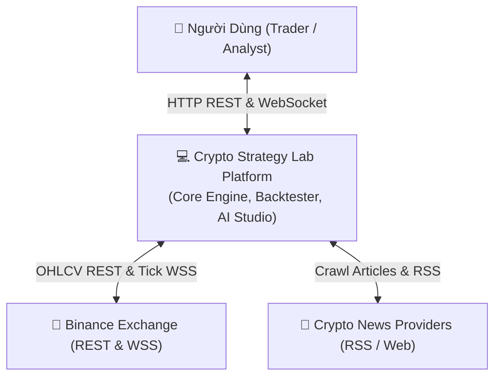
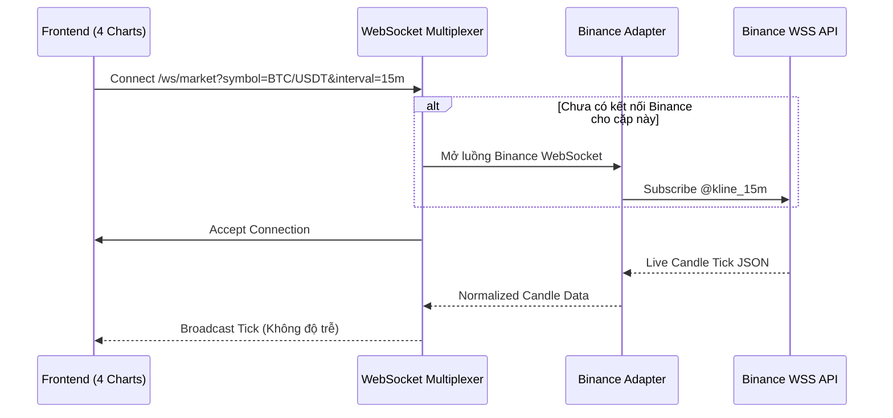
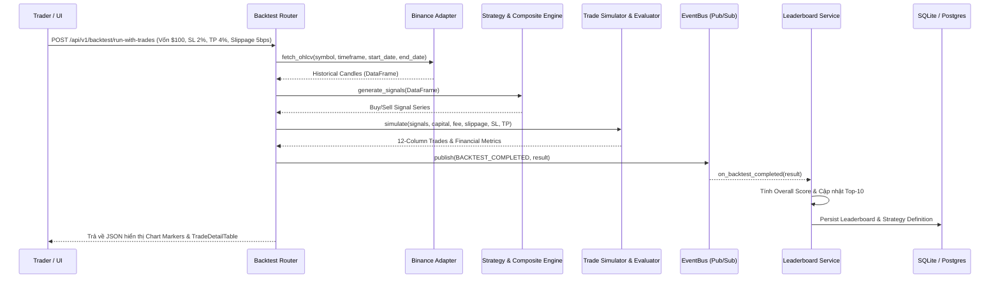

# Tài Liệu Kiến Trúc Phần Mềm (Software Architecture Document)
## Crypto Strategy Lab – Nền Tảng Phân Tích, Kết Hợp và Đánh Giá Chiến Lược Giao Dịch Crypto

> **Môn học**: Kiến trúc Phần mềm (Software Architecture)  
> **Trọng tâm đồ án**: Thiết kế Kiến trúc Phần mềm có khả năng mở rộng (Extensibility), chịu tải (Scalability), lỏng khớp (Loose Coupling), dễ bảo trì (Maintainability) và kiểm chứng độc lập (Verification Loop).

---

## 1. Bối Cảnh Hệ Thống (System Context - C4 Model Level 1)

Hệ thống **Crypto Strategy Lab** hoạt động như một nền tảng thực nghiệm và phân tích chiến lược tự động. Hệ thống tương tác với các tác nhân bên ngoài:
- **Người dùng (Trader / Quản trị viên)**: Tương tác qua giao diện Web SPA để theo dõi thị trường thời gian thực, cấu hình backtest, sinh chiến lược qua prompt tự nhiên và tìm kiếm biến thể tối ưu.
- **Sàn giao dịch Binance**: Cung cấp dữ liệu nến lịch sử (REST API) và luồng giá realtime (WebSocket).
- **Nguồn Tin Tức (RSS / Web News Providers)**: Cung cấp bài viết, tin tức thị trường crypto cập nhật.
- **Mô Hình AI / Machine Learning**: Phân tích cảm xúc tin tức (FinBERT) và bóc tách câu lệnh tự nhiên (NLP Intent Parser).



---

## 2. Phân Rã Module & Container (Container Decomposition - C4 Level 2)

Hệ thống được thiết kế theo nguyên lý **Clean Architecture** kết hợp **Hexagonal Architecture (Ports and Adapters)** và **Event-Driven Architecture**:

```mermaid
graph TD
    subgraph "Frontend Layer (React 19 + Vite + TypeScript)"
        Dash["Market Dashboard (4-Timeframe WSS)"]
        BacktestUI["Backtest Workbench (/backtest)"]
        StudioUI["AI Strategy Studio (/strategy-studio)"]
        SearchUI["AI Search Engine (/search)"]
        LeaderboardUI["Leaderboard (/leaderboard)"]
        NewsUI["News Feed & NLP Sentiment (/news)"]
    end

    subgraph "Interface Adapters (API & WebSockets)"
        FastAPI["FastAPI REST Routers"]
        WSMultiplexer["WebSocket Multiplexer Manager"]
    end

    subgraph "Application Core Layer (Services & Engine)"
        StrategyEngine["Strategy Registry & Plugin Engine"]
        CompositeEngine["Composite Logic & Weighted Engine"]
        BacktestEngine["Backtest & Trade Simulator Engine"]
        Evaluator["Backtest Financial Evaluator"]
        LeaderboardService["Leaderboard Service (Top-K)"]
        SearchEngine["Strategy Search (Random & Genetic GA)"]
        NewsService["News Collector & Tag Schema Crawler"]
        MLService["NLP Sentiment Service (FinBERT)"]
        AIParser["Natural Language Strategy Parser"]
    end

    subgraph "Message Broker & Storage Layer"
        EventBus[("EventBus / Redis Message Broker")]
        DB[("Database (SQLite / PostgreSQL)")]
    end

    subgraph "External Infrastructure Adapters"
        BinanceAdapter["BinanceAdapter (Async CCXT)"]
        SmartCrawler["Smart Web Crawler (HTML Tag Learner)"]
    end

    Frontend Layer <-->|HTTP / JSON| FastAPI
    Frontend Layer <-->|WebSocket Stream| WSMultiplexer

    FastAPI --> Application Core Layer
    WSMultiplexer --> BinanceAdapter

    Application Core Layer --> EventBus
    EventBus --> LeaderboardService
    EventBus --> WSMultiplexer

    Application Core Layer --> DB
    Application Core Layer --> External Infrastructure Adapters
```

---

## 3. Trách Nhiệm Chi Tiết Của Từng Thành Phần (Component Responsibilities)

### 3.1. Domain Layer (`backend/src/domain/`)
- **`IStrategy`**: Interface chuẩn mực quy định hàm `generate_signals(df) -> SignalSeries`. Mọi chiến lược mới chỉ cần cài đặt interface này.
- **`IExchangeAdapter`**: Interface chuẩn để kết nối các sàn giao dịch (Binance, OKX, Bybit).
- **`INewsProvider`**: Interface thu thập tin tức độc lập nguồn dữ liệu.
- **Entities & Dataclasses**: `Candle`, `TradeRecord`, `BacktestMetrics`, `SignalSeries`.

### 3.2. Strategy Plugin Architecture (`backend/src/strategies/`)
- **`StrategyRegistry`**: Kho đăng ký và quản lý các chiến lược đơn lẻ (`MAStrategy`, `RSIStrategy`, `BollingerBandsStrategy`, `SupportResistanceStrategy`, `SMCStrategy`, `NewsSentimentStrategy`).
- **`CompositeStrategy`**: Cho phép kết hợp $N$ chiến lược đơn lẻ bất kỳ theo:
  - **Logic AND**: Tất cả chiến lược cùng đồng thuận thì mới vào lệnh.
  - **Logic OR**: Bất kỳ chiến lược nào có tín hiệu thì vào lệnh.
  - **Logic WEIGHTED**: Tính tổng điểm có trọng số $Score = \sum (Signal_i \times Weight_i)$. Nếu $Score > \text{threshold}$ thì BUY, ngược lại SELL.

### 3.3. Backtesting & Trade Simulation Engine (`backend/src/services/backtest/`)
- **`TradeSimulator`**: Giả lập vào/thoát lệnh theo nến lịch sử, hỗ trợ cả vị thế **LONG** và **SHORT**.
- **Quản trị rủi ro bắt buộc**: Cắt lỗ (**Stop Loss %**), Chốt lời (**Take Profit %**), **Trailing Stop %**.
- **Hạch toán chi phí chuẩn tài chính**:
  - Khối lượng lệnh quy đổi tiền mặt theo vốn ban đầu (ví dụ: `$100.00`).
  - Phí giao dịch (Transaction Fee, mặc định `0.05%`).
  - Giả lập trượt giá thị trường (**Slippage 5bps** $= 0.05\%$).
- **`BacktestEvaluator`**: Tính toán 8 chỉ số hiệu năng độc lập khỏi logic giao dịch:
  $$\text{Winrate} = \frac{\text{Wins}}{\text{Total Trades}}, \quad \text{MDD}, \quad \text{Profit Factor} = \frac{\text{Gross Profit}}{\text{Gross Loss}}, \quad \text{Sharpe Ratio}, \quad \text{Total Net Profit (\$)}$$

### 3.4. Continuous Strategy Loop & AI Search Engine (`backend/src/services/search/`)
- **`RandomSearch`**: Sinh ngẫu nhiên các tổ hợp chỉ báo và tham số.
- **`GeneticSearch` (Giải thuật Di truyền - GA)**:
  - Khởi tạo quần thể biến thể chiến lược.
  - Đánh giá hàm thích nghi (Fitness Function).
  - Chọn lọc (Selection), Lai ghép (Crossover) và Đột biến (Mutation) qua nhiều thế hệ để liên tục tìm kiếm tổ hợp vượt trội.
- **Vòng lặp ngầm (Continuous Loop)**: Kiểm soát trạng thái chạy (Pause, Resume, Stop Condition khi đạt max iterations hoặc không cải thiện sau $N$ vòng).

### 3.5. AI Strategy Studio & Natural Language Parser (`backend/src/services/ai/`)
- Phân tích câu lệnh tự nhiên (ví dụ: *"RSI 30 và giá dưới Bollinger Lower Band 20, Stop loss 2%, take profit 4%"*) hoặc bài viết kỹ thuật.
- Bóc tách chỉ báo, điều kiện Long/Short, Stop Loss, Take Profit.
- Chuẩn hóa thành **JSON Schema chuẩn** và thực hiện **Kiểm tra & Validation** (thiếu trường, logic hợp lệ, chỉ báo hỗ trợ).
- Lưu vào **Strategy Library** (`strategy_definitions`) để tái sử dụng.

### 3.6. Smart Web Crawler & Sentiment ML Pipeline (`backend/src/services/crawler/`, `backend/src/services/ML/`)
- **Smart Crawler**: Crawl nội dung bài viết từ URL bất kỳ, tự động học và lưu cấu trúc HTML Tag (`h1`, `article p`, `time`, `og:title`) vào SQLite (`crawler_tag_schemas`).
- **Sentiment Model**: Mô hình NLP FinBERT chấm điểm cảm xúc tin tức (-1.0 đến +1.0) và cấp tín hiệu cho `NewsSentimentStrategy`.

### 3.7. Authentication & Security Layer (`backend/src/core/security.py`, `backend/src/api/v1/auth_router.py`)
- **JSON Web Tokens (JWT)**: Xác thực phiên người dùng theo chuẩn RFC 7519 HMAC-SHA256, tự động gán hạn sử dụng 24h.
- **Mã hóa mật khẩu an toàn**: Thuật toán PBKDF2-HMAC-SHA256 với muối ngẫu nhiên (salt 32 bytes) và 100.000 vòng lặp.
- **Role-Based Access Control (RBAC)**: Phân quyền vai trò người dùng (`trader`, `analyst`, `admin`).
- **FastAPI Auth Dependencies**: `get_current_user` và `get_optional_user` kiểm tra token tự động tại các endpoints.
- **Frontend Auth Context & Interceptor**: Quản lý phiên `localStorage`, tự động gắn `Authorization: Bearer <token>` vào request header, hiển thị User Avatar & Modal Đăng nhập/Đăng ký.

---

## 4. Các Luồng Dữ Liệu Chính (Data Flows)

### 4.1. Luồng WebSocket Realtime (Multi-Timeframe Streaming)


### 4.2. Luồng Backtest & Event-Driven Leaderboard Update


---

## 5. Trả Lời 8 Câu Hỏi Kiến Trúc Cốt Lõi (Architectural Evaluation)

Theo yêu cầu mục 40 của đồ án, hệ thống trả lời và giải quyết triệt để 8 câu hỏi kiến trúc:

| STT | Câu hỏi kiến trúc | Lời giải đáp & Thiết kế của hệ thống |
| :--- | :--- | :--- |
| **1** | **Strategy mới (như MACD) được thêm như thế nào? Cần sửa component nào?** | Chỉ cần tạo file `macd.py` kế thừa `BaseStrategy`, cài đặt hàm `generate_signals()` và gọi `strategy_registry.register(MACDStrategy)`. **Không cần sửa bất kỳ dòng code nào** trong Controller, Backtester, Evaluator, Leaderboard hay Frontend. |
| **2** | **Thêm Search Algorithm mới (từ Random sang Genetic) có ảnh hưởng Backtester không?** | **Hoàn toàn không**. `GeneticSearch` và `RandomSearch` chỉ sinh ra các `CandidateStrategy`. `BacktestEvaluator` nhận candidate và thực thi độc lập, không quan tâm candidate được sinh ra từ thuật toán nào. |
| **3** | **Thêm Market Data Provider mới (Binance $\rightarrow$ OKX, Bybit) có phải sửa Frontend không?** | **Không phải sửa Frontend**. `BinanceAdapter` và `OKXAdapter` đều cài đặt chung `IExchangeAdapter` và chuẩn hóa về đối tượng `Candle`. Frontend chỉ giao tiếp với Backend API qua chuẩn dữ liệu thống nhất. |
| **4** | **Nếu số backtest tăng từ 100 lên 100.000 thì kiến trúc scale ra sao?** | Hệ thống sử dụng kiến trúc **Producer-Consumer với Celery Worker Pool và Redis Job Queue**. Các tác vụ backtest được đẩy vào hàng đợi và phân phối đều cho $N$ background workers chạy song song trên nhiều CPU/máy chủ. |
| **5** | **Nếu News Service bị lỗi thì Chart có còn chạy không?** | **Vẫn chạy bình thường 100%**. News Service và Market Data Service là 2 module độc lập (Loose Coupling). Lỗi crawl tin tức được bắt gọn và cách ly, không ảnh hưởng đến luồng WebSocket nến của Chart. |
| **6** | **Nếu Sentiment Model thay đổi (từ FinBERT sang GPT-4) thì Strategy Engine có bị ảnh hưởng không?** | **Không bị ảnh hưởng**. `SentimentService` cung cấp hàm chuẩn `analyze(text) -> SentimentResult(label, score)`. Dù thay đổi model ML bên dưới, kết quả trả về cho `NewsSentimentStrategy` vẫn giữ nguyên interface. |
| **7** | **Nếu Binance WebSocket disconnect thì hệ thống phục hồi như thế nào?** | `BinanceAdapter` cài đặt cơ chế **Auto-Reconnect với Exponential Backoff**. Khi mất mạng, hệ thống tự động thử lại sau 1s, 2s, 4s... và tự động fetch bù các nến bị thiếu qua REST API khi kết nối lại. |
| **8** | **Làm sao kiểm tra một kết quả trên Leaderboard được tạo ra bởi version strategy nào?** | Bảng `strategy_definitions` và `backtest_results` lưu trữ trường `version`, `params_json` và mã băm hash `id`. Mọi kết quả trên Leaderboard đều có khóa ngoại liên kết chính xác tới phiên bản định nghĩa chiến lược (**Reproducibility**). |

---

## 6. Các Anti-Pattern Đã Được Loại Bỏ Hoàn Toàn

1. ❌ **God Service**: Không dồn toàn bộ code vào một file. Hệ thống chia tách thành các Service chuyên trách: `MarketService`, `StrategyRegistry`, `BacktestEvaluator`, `LeaderboardService`, `SmartCrawler`, `SentimentService`.
2. ❌ **Hard-coded Strategy**: Không dùng các khối lệnh `if strategy == 'MA' elif ...`. Toàn bộ chiến lược được quản lý động qua `StrategyRegistry` và `CompositeStrategy`.
3. ❌ **Frontend chứa Business Logic**: Toàn bộ logic phân tích kỹ thuật, tính toán tín hiệu, giả lập lệnh, trừ phí, slippage 5bps và chấm điểm được thực thi 100% ở Backend. Frontend chỉ đảm nhận hiển thị UI/UX.
4. ❌ **Strategy truy cập trực tiếp Database**: Các chiến lược giao dịch là pure logic functions nhận DataFrame nến và trả về tín hiệu, hoàn toàn không dính líu đến SQL/Database.
5. ❌ **Crawler phụ thuộc chặt vào ML**: Bộ thu thập dữ liệu (Crawler) chỉ chịu trách nhiệm lấy HTML và lưu schema tag; việc chấm điểm cảm xúc do `SentimentService` phụ trách riêng biệt.

---

## 7. Các Thuộc Tính Chất Lượng Đạt Được (Quality Attributes)

- **Modifiability (Tính dễ sửa đổi & mở rộng)**: Đạt điểm tối đa nhờ Plugin Pattern và Registry.
- **Scalability (Tính mở rộng quy mô)**: Sẵn sàng cho Multi-workers, Redis Pub/Sub, Celery Queue.
- **Reliability & Fault Tolerance (Độ tin cậy)**: Cách ly lỗi giữa các module, tự phục hồi kết nối.
- **Observability (Khả năng quan sát)**: Theo dõi tiến độ search, số candidates đã thử, trạng thái worker, lịch sử 12 cột chi tiết và visual markers trên biểu đồ.
