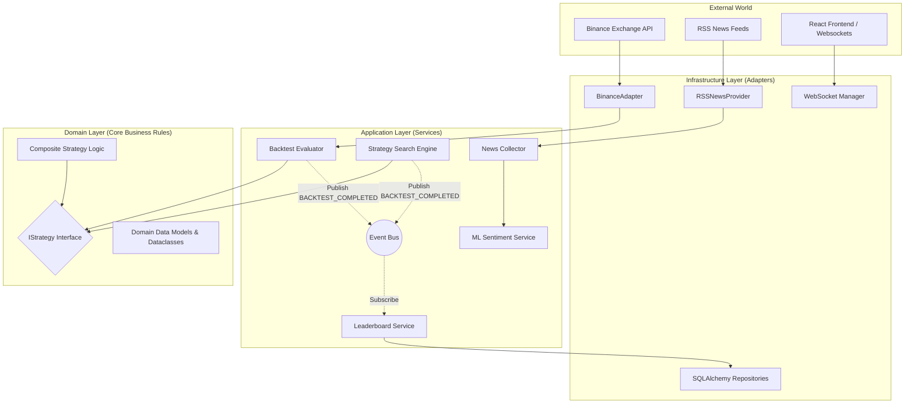

# System Architecture Overview

Crypto Strategy Lab is built following a modular, loosely-coupled adaptation of **Clean Architecture** and **Hexagonal Architecture (Ports and Adapters)** principles. This ensures that core trading domain logic remains highly isolated from external infrastructure changes like database swaps, API rate limits, or frontend modifications.

## Module Diagram



## Data Flow Diagrams

### 1. Strategy Backtest Execution
1. **Client** POSTs configuration to `/api/v1/backtest/run`.
2. **Main Router** calls `BinanceAdapter.fetch_ohlcv()`.
3. **Main Router** instantiates requested `Strategy` (or `CompositeStrategy`).
4. **Strategy** evaluates data and generates `Signal Series`.
5. **BacktestEvaluator** processes signals into trades, generating metrics (Profit, WinRate, Sharpe).
6. **Main Router** publishes `BACKTEST_COMPLETED` event.
7. **EventBus** asynchronously alerts `LeaderboardService`.
8. Result returned to **Client**.

### 2. Live Market Streaming
1. **Client** connects to `/ws/market?symbol=BTC/USDT`.
2. **WebSocket Manager** checks if an active `Binance WSS` task exists for this symbol.
   - *If no:* Creates a new Async Task connecting to Binance.
   - *If yes:* Attaches client to existing stream.
3. **Binance WSS** streams JSON ticks.
4. **WebSocket Manager** parses and broadcasts to all attached **Clients** efficiently (Multiplexing).

## Key Design Decisions

1. **Event-Driven Decoupling:** Instead of deep dependency injection graphs, core services communicate asynchronously via a singleton `EventBus`. This prevents circular dependencies (e.g., between the Search Engine and the Leaderboard).
2. **Plugin Strategy Pattern:** Strategies subclass `BaseStrategy`. The `StrategyRegistry` dynamically registers them at runtime. Adding a new strategy requires zero modifications to core services.
3. **Lazy-Loading ML Models:** Loading HuggingFace models consumes significant RAM. The `SentimentService` defers loading until the first explicit API request, keeping base application boot times under 1 second.
4. **Resilient Adapters:** External adapters (Binance WS, RSS Feeds) wrap logic in try/catch blocks with exponential backoffs, preventing external API downtimes from crashing the backend.

## Directory Structure

```
Project/
├── backend/
│   ├── src/
│   │   ├── api/               # External boundaries (REST endpoints, WebSockets)
│   │   ├── domain/            # Core business objects (Interfaces, Dataclasses)
│   │   ├── infrastructure/    # Database models, External APIs, EventBus
│   │   ├── services/          # Backtest Engine, AI Search, ML, Leaderboard
│   │   ├── strategies/        # Specific trading algorithms and Composite logic
│   │   └── main.py            # Application entrypoint
│   └── requirements.txt
├── frontend/
│   ├── src/
│   │   ├── components/        # Reusable React components (Charts, Tables)
│   │   ├── pages/             # Route-level views (Dashboard, Search, News)
│   │   ├── shared/hooks/      # Reusable React hooks (useWebSocket)
│   │   ├── App.tsx            # Main router
│   │   └── main.tsx           # React entrypoint
│   ├── package.json
│   └── tailwind.config.js
└── docs/                      # Project documentation and ADRs
```
