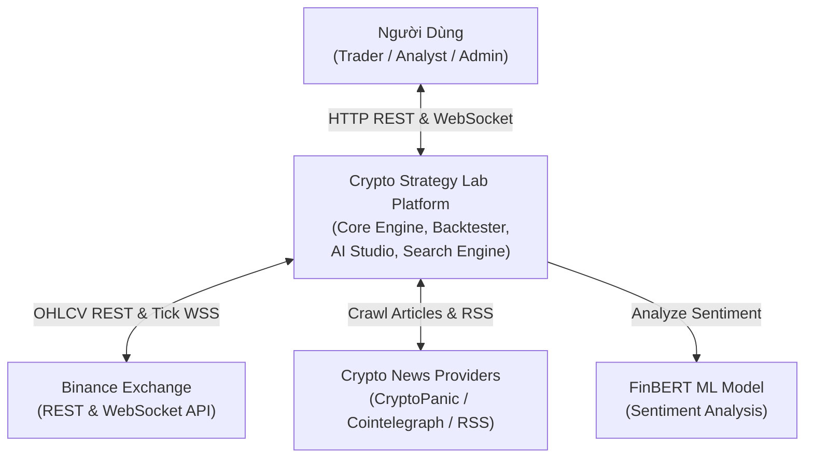
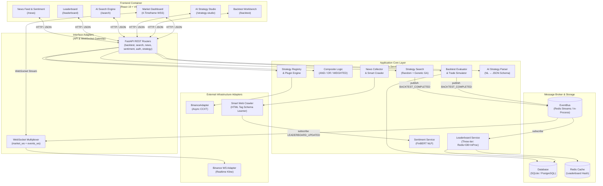
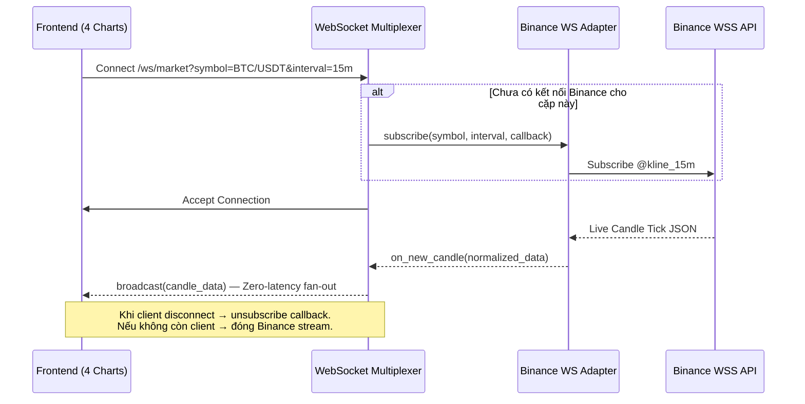
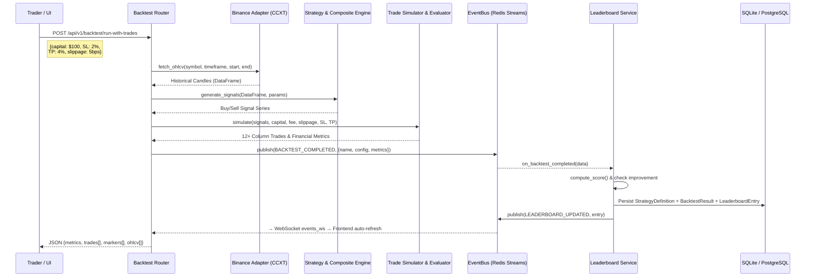
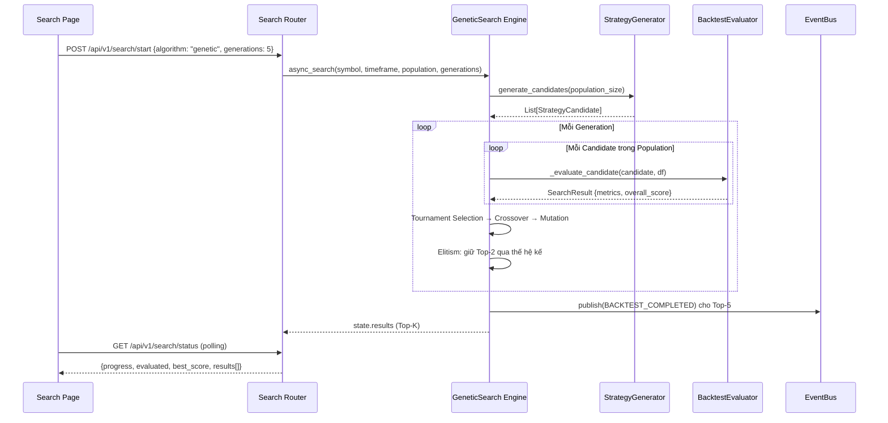
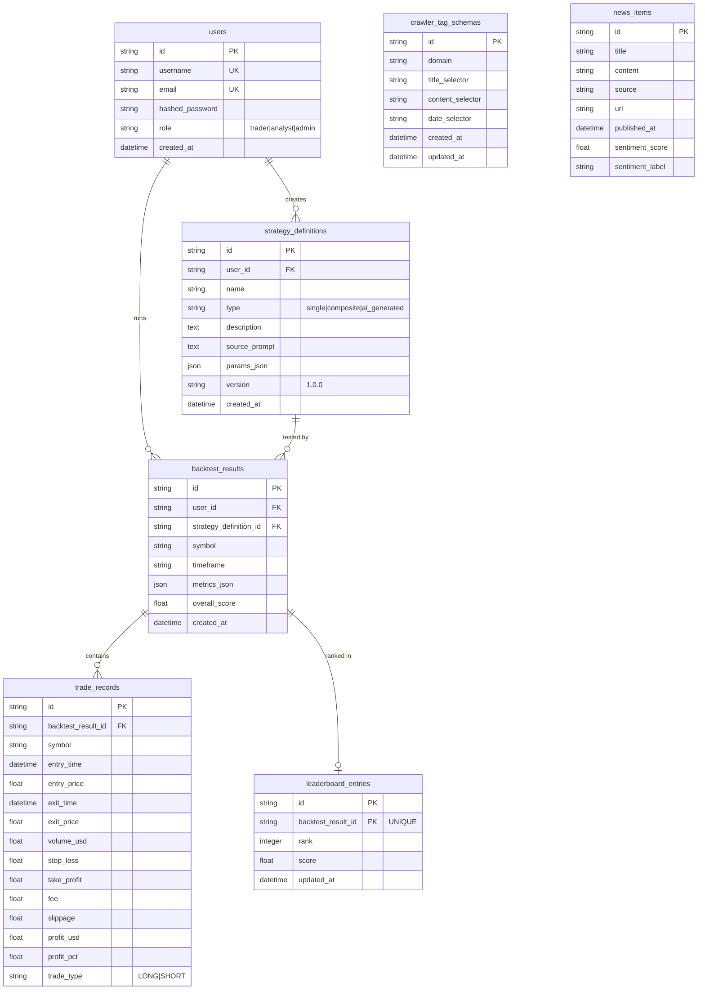

# Tài Liệu Kiến Trúc Phần Mềm (Software Architecture Document)
## Crypto Strategy Lab – Nền Tảng Phân Tích, Kết Hợp và Đánh Giá Chiến Lược Giao Dịch Crypto

> **Môn học**: Kiến trúc Phần mềm (Software Architecture)  
> **Trọng tâm đồ án**: Thiết kế Kiến trúc Phần mềm có khả năng mở rộng, chịu tải, lỏng khớp, dễ bảo trì và kiểm chứng độc lập.

---

## 1. Bối Cảnh Hệ Thống (System Context – C4 Model Level 1)

Hệ thống **Crypto Strategy Lab** hoạt động như một nền tảng thực nghiệm và phân tích chiến lược tự động. Hệ thống tương tác với các tác nhân bên ngoài:
- **Người dùng (Trader / Quản trị viên)**: Tương tác qua giao diện Web SPA để theo dõi thị trường thời gian thực, cấu hình backtest, sinh chiến lược qua prompt tự nhiên và tìm kiếm biến thể tối ưu.
- **Sàn giao dịch Binance**: Cung cấp dữ liệu nến lịch sử (REST API) và luồng giá realtime (WebSocket).
- **Nguồn Tin Tức (RSS / Web News Providers)**: Cung cấp bài viết, tin tức thị trường crypto cập nhật.
- **Mô Hình AI / Machine Learning**: Phân tích cảm xúc tin tức (FinBERT) và bóc tách câu lệnh tự nhiên (NLP Intent Parser).


```mermaid
graph TD
    User[" Người Dùng<br/>(Trader / Analyst / Admin)"]
    Binance[" Binance Exchange<br/>(REST & WebSocket API)"]
    NewsSources[" Crypto News Providers<br/>(CryptoPanic / Cointelegraph / RSS)"]
    FinBERT[" FinBERT ML Model<br/>(Sentiment Analysis)"]
    
    System[" Crypto Strategy Lab Platform<br/>(Core Engine, Backtester,<br/>AI Studio, Search Engine)"]
    
    User <-->|"HTTP REST & WebSocket"| System
    System <-->|"OHLCV REST & Tick WSS"| Binance
    System <-->|"Crawl Articles & RSS"| NewsSources
    System -->|"Analyze Sentiment"| FinBERT
```

---

## 2. Phân Rã Container (Container Decomposition – C4 Level 2)

Hệ thống được thiết kế theo nguyên lý **Clean Architecture** kết hợp **Hexagonal Architecture (Ports and Adapters)** và **Event-Driven Architecture**:


```mermaid
graph TD
    subgraph "Frontend Container<br/>(React 19 + Vite + TypeScript)"
        Dash[" Market Dashboard<br/>(4-Timeframe WSS)"]
        BacktestUI[" Backtest Workbench<br/>(/backtest)"]
        StudioUI[" AI Strategy Studio<br/>(/strategy-studio)"]
        SearchUI[" AI Search Engine<br/>(/search)"]
        LeaderboardUI[" Leaderboard<br/>(/leaderboard)"]
        NewsUI[" News Feed & Sentiment<br/>(/news)"]
    end

    subgraph "Interface Adapters<br/>(API & WebSocket Gateway)"
        FastAPI["FastAPI REST Routers<br/>(backtest, search, news,<br/>sentiment, auth, strategy)"]
        WSMultiplexer["WebSocket Multiplexer<br/>(market_ws + events_ws)"]
    end

    subgraph "Application Core Layer<br/>(Domain Services & Engine)"
        StrategyEngine["Strategy Registry<br/>& Plugin Engine"]
        CompositeEngine["Composite Logic<br/>(AND / OR / WEIGHTED)"]
        BacktestEngine["Backtest Evaluator<br/>& Trade Simulator"]
        LeaderboardService["Leaderboard Service<br/>(Three-tier: Redis+DB+InProc)"]
        SearchEngine["Strategy Search<br/>(Random + Genetic GA)"]
        NewsService["News Collector<br/>& Smart Crawler"]
        MLService["Sentiment Service<br/>(FinBERT NLP)"]
        AIParser["AI Strategy Parser<br/>(NL → JSON Schema)"]
    end

    subgraph "Message Broker & Storage"
        EventBus[("EventBus<br/>(Redis Streams / In-Process)")]
        DB[("Database<br/>(SQLite / PostgreSQL)")]
        RedisCache[("Redis Cache<br/>(Leaderboard Hash)")]
    end

    subgraph "External Infrastructure Adapters"
        BinanceAdapter["BinanceAdapter<br/>(Async CCXT)"]
        BinanceWSAdapter["Binance WS Adapter<br/>(Realtime Kline)"]
        SmartCrawler["Smart Web Crawler<br/>(HTML Tag Schema Learner)"]
    end

    Dash & BacktestUI & StudioUI & SearchUI & LeaderboardUI & NewsUI <-->|"HTTP / JSON"| FastAPI
    Dash <-->|"WebSocket Stream"| WSMultiplexer

    FastAPI --> StrategyEngine & CompositeEngine & BacktestEngine & SearchEngine & AIParser
    WSMultiplexer --> BinanceWSAdapter

    BacktestEngine -->|"publish BACKTEST_COMPLETED"| EventBus
    SearchEngine -->|"publish BACKTEST_COMPLETED"| EventBus
    EventBus -->|"subscribe"| LeaderboardService
    EventBus -->|"subscribe LEADERBOARD_UPDATED"| WSMultiplexer

    LeaderboardService --> DB & RedisCache
    BacktestEngine --> DB
    NewsService --> SmartCrawler
    SmartCrawler --> MLService
    StrategyEngine --> BinanceAdapter
```

---

## 3. Phân Rã Thành Phần Chi Tiết (Component Diagram – C4 Level 3)

### 3.1. Domain Layer (`backend/src/domain/`)

| Interface | File | Mô tả |
|:---|:---|:---|
| `IStrategy` | `interfaces.py` | Hợp đồng chuẩn: `id`, `name`, `description`, `default_params`, `generate_signals(df, params) → pd.Series` |
| `IExchangeAdapter` | `adapters/base_exchange.py` | Hợp đồng kết nối sàn: `fetch_ohlcv(symbol, timeframe, limit) → DataFrame` |
| `INewsProvider` | `news_interfaces.py` | Hợp đồng thu thập tin: `fetch_news(query, limit) → List[NewsItem]` |

Các entity/dataclass: `NewsItem(id, title, content, source, url, published_at, sentiment_score, sentiment_label)`.

### 3.2. Strategy Plugin Architecture (`backend/src/strategies/`)

```
strategies/
 base.py                    ← BaseStrategy(IStrategy) – utility get_params()
 registry.py                ← StrategyRegistry (Singleton, Auto-Discovery)
 composite.py               ← CompositeStrategy (AND / OR / WEIGHTED)
 implementations/
     ma_strategy.py          ← MA Crossover (short_window, long_window)
     rsi_strategy.py         ← RSI (window, overbought, oversold)
     bollinger_strategy.py   ← Bollinger Bands (period, std_dev)
     support_resistance_strategy.py ← Support & Resistance
     smc_strategy.py         ← Smart Money Concepts (Order Block)
     news_sentiment_strategy.py     ← News Sentiment (FinBERT score)
```

- **`StrategyRegistry`** (Singleton): Tự động scan thư mục `implementations/`, nạp mọi class kế thừa `IStrategy`, đăng ký bằng `strategy_id`. Không cần import thủ công.
- **`CompositeStrategy`**: Kết hợp $N$ chiến lược đơn lẻ theo logic:
  - **AND**: Tất cả chiến lược cùng đồng thuận → BUY/SELL.
  - **OR**: Bất kỳ chiến lược nào phát tín hiệu → BUY/SELL (xung đột → HOLD).
  - **WEIGHTED**: $Score = \sum (Signal_i \times Weight_i)$. Nếu $Score > 0.5$ → BUY, $Score < -0.5$ → SELL.

### 3.3. Backtesting & Trade Simulation Engine (`backend/src/services/backtest/`)

- **`BacktestEvaluator`**: Tính toán metrics tài chính từ signals + price data (vectorized Pandas):
  - Total Return, Total Profit USD, Max Drawdown, Winrate, Wins/Losses Count, Profit Factor, Sharpe Ratio.
  - Hạch toán chi phí: Phí giao dịch (mặc định 0.05%), Slippage (5bps = 0.05%).
- **`TradeSimulator`**: Giả lập vào/thoát lệnh chi tiết cho cả LONG và SHORT:
  - Stop Loss %, Take Profit %, Trailing Stop %.
  - Xuất 12+ cột chi tiết: STT, Pair, Direction, Entry/Exit Time & Price, Volume USD, SL, TP, Fee, Slippage, Net Profit.

### 3.4. AI Search Engine (`backend/src/services/search/`)

| Class | Thuật toán | Mô tả |
|:---|:---|:---|
| `StrategyGenerator` | — | Sinh ngẫu nhiên `StrategyCandidate` (1–3 strategies, random params, random logic) |
| `RandomSearch` | Monte Carlo | Sinh $N$ candidates → Backtest → Rank by overall score → Top-K |
| `GeneticSearch` | Genetic Algorithm | Population → Evaluate → Tournament Selection → Crossover → Mutation → Next Gen |
| `tasks.py` | Celery Task | Worker pool cho phép scale search ra nhiều process/máy chủ |

- **Vòng lặp ngầm**: Hỗ trợ Pause / Resume / Stop. `asyncio.sleep(0.01)` yield control cho event loop.
- **Overall Score**: $0.4 \times \tanh(return) + 0.3 \times winrate + 0.2 \times (1 + mdd) + 0.1 \times \tanh(sharpe/3)$

### 3.5. AI Strategy Studio (`backend/src/services/ai/`)

- **`AIStrategyParser`**: Phân tích prompt tự nhiên bằng regex pattern matching:
  - Nhận diện chỉ báo (RSI, BB, MA, SMC, Support/Resistance, News Sentiment).
  - Trích xuất Stop Loss, Take Profit, Trailing Stop.
  - Xuất JSON Schema chuẩn hóa + Validation status.
  - Persist vào bảng `strategy_definitions` với `source_prompt`, `version`, `params_json`.

### 3.6. Smart Crawler & Sentiment ML Pipeline

- **`SmartCrawler`** (`services/crawler/`): Crawl bài viết từ URL bất kỳ với anti-bot mitigation:
  - Tự học cấu trúc HTML (og:title, h1, article p, time) và lưu tag schema vào DB (`crawler_tag_schemas`).
  - Fallback bằng URL-slug extraction khi bị Cloudflare block.
- **`SentimentService`** (`services/ML/`): FinBERT chấm điểm cảm xúc (-1.0 → +1.0), trả `SentimentResult(label, score)`.

### 3.7. Event Bus & Message Broker (`infrastructure/message_broker/`)

**`EventBus`** (Singleton) hỗ trợ 2 mode:
1. **Redis Streams** (production): XADD/XREADGROUP/XACK – persistent, at-least-once delivery, consumer groups.
2. **In-process** (fallback/dev): Fire-and-forget Pub/Sub khi Redis không available.

Event types: `BACKTEST_COMPLETED`, `LEADERBOARD_UPDATED`, `STRATEGY_GENERATED`, `NEWS_COLLECTED`, `SENTIMENT_ANALYZED`, `MARKET_PRICE_UPDATED`.

### 3.8. Leaderboard Service (`services/leaderboard/`)

Three-tier storage strategy:
1. **Redis Hash** (`leaderboard:entries`): Cross-worker shared state, TTL 24h.
2. **SQLite / PostgreSQL**: Persistent storage qua ORM (`leaderboard_entries` ↔ `backtest_results` ↔ `strategy_definitions`).
3. **In-process Dict**: Fast local read cache, merge với Redis khi `get_all()`.

### 3.9. Authentication & Security (`core/security.py`, `api/v1/auth_router.py`)

- **JWT** (HMAC-SHA256, 24h expiry), **PBKDF2-HMAC-SHA256** password hashing (32-byte salt, 100K iterations).
- **RBAC**: `trader`, `analyst`, `admin`.
- **FastAPI Dependencies**: `get_current_user`, `get_optional_user`.

---

## 4. Các Luồng Dữ Liệu Chính (Key Data Flows)

### 4.1. Luồng WebSocket Realtime (Multi-Timeframe Streaming)


```mermaid
sequenceDiagram
    participant UI as Frontend (4 Charts)
    participant WS as WebSocket Multiplexer
    participant BA as Binance WS Adapter
    participant B as Binance WSS API

    UI->>WS: Connect /ws/market?symbol=BTC/USDT&interval=15m
    alt Chưa có kết nối Binance cho cặp này
        WS->>BA: subscribe(symbol, interval, callback)
        BA->>B: Subscribe @kline_15m
    end
    WS->>UI: Accept Connection
    B-->>BA: Live Candle Tick JSON
    BA-->>WS: on_new_candle(normalized_data)
    WS-->>UI: broadcast(candle_data) — Zero-latency fan-out
    Note over UI,WS: Khi client disconnect → unsubscribe callback.<br/>Nếu không còn client → đóng Binance stream.
```

### 4.2. Luồng Backtest & Event-Driven Leaderboard Update


```mermaid
sequenceDiagram
    participant User as Trader / UI
    participant API as Backtest Router
    participant Adapter as Binance Adapter (CCXT)
    participant Engine as Strategy & Composite Engine
    participant Sim as Trade Simulator & Evaluator
    participant Bus as EventBus (Redis Streams)
    participant LB as Leaderboard Service
    participant DB as SQLite / PostgreSQL

    User->>API: POST /api/v1/backtest/run-with-trades
    Note right of User: {capital: $100, SL: 2%,<br/>TP: 4%, slippage: 5bps}
    API->>Adapter: fetch_ohlcv(symbol, timeframe, start, end)
    Adapter-->>API: Historical Candles (DataFrame)
    API->>Engine: generate_signals(DataFrame, params)
    Engine-->>API: Buy/Sell Signal Series
    API->>Sim: simulate(signals, capital, fee, slippage, SL, TP)
    Sim-->>API: 12+ Column Trades & Financial Metrics
    API->>Bus: publish(BACKTEST_COMPLETED, {name, config, metrics})
    Bus-->>LB: on_backtest_completed(data)
    LB->>LB: compute_score() & check improvement
    LB->>DB: Persist StrategyDefinition + BacktestResult + LeaderboardEntry
    LB->>Bus: publish(LEADERBOARD_UPDATED, entry)
    Bus-->>API: → WebSocket events_ws → Frontend auto-refresh
    API-->>User: JSON {metrics, trades[], markers[], ohlcv[]}
```

### 4.3. Luồng AI Search (Genetic Algorithm)


```mermaid
sequenceDiagram
    participant UI as Search Page
    participant API as Search Router
    participant GA as GeneticSearch Engine
    participant Gen as StrategyGenerator
    participant Eval as BacktestEvaluator
    participant Bus as EventBus

    UI->>API: POST /api/v1/search/start {algorithm: "genetic", generations: 5}
    API->>GA: async_search(symbol, timeframe, population, generations)
    GA->>Gen: generate_candidates(population_size)
    Gen-->>GA: List[StrategyCandidate]
    
    loop Mỗi Generation
        loop Mỗi Candidate trong Population
            GA->>Eval: _evaluate_candidate(candidate, df)
            Eval-->>GA: SearchResult {metrics, overall_score}
        end
        GA->>GA: Tournament Selection → Crossover → Mutation
        GA->>GA: Elitism: giữ Top-2 qua thế hệ kế
    end
    
    GA->>Bus: publish(BACKTEST_COMPLETED) cho Top-5
    GA-->>API: state.results (Top-K)
    UI->>API: GET /api/v1/search/status (polling)
    API-->>UI: {progress, evaluated, best_score, results[]}
```

---

## 5. Cấu Trúc Database (Data Model)


```mermaid
erDiagram
    users ||--o{ strategy_definitions : "creates"
    users ||--o{ backtest_results : "runs"
    strategy_definitions ||--o{ backtest_results : "tested by"
    backtest_results ||--o{ trade_records : "contains"
    backtest_results ||--o| leaderboard_entries : "ranked in"

    users {
        string id PK
        string username UK
        string email UK
        string hashed_password
        string role "trader|analyst|admin"
        datetime created_at
    }

    strategy_definitions {
        string id PK
        string user_id FK
        string name
        string type "single|composite|ai_generated"
        text description
        text source_prompt
        json params_json
        string version "1.0.0"
        datetime created_at
    }

    backtest_results {
        string id PK
        string user_id FK
        string strategy_definition_id FK
        string symbol
        string timeframe
        json metrics_json
        float overall_score
        datetime created_at
    }

    trade_records {
        string id PK
        string backtest_result_id FK
        string symbol
        datetime entry_time
        float entry_price
        datetime exit_time
        float exit_price
        float volume_usd
        float stop_loss
        float take_profit
        float fee
        float slippage
        float profit_usd
        float profit_pct
        string trade_type "LONG|SHORT"
    }

    leaderboard_entries {
        string id PK
        string backtest_result_id FK "UNIQUE"
        integer rank
        float score
        datetime updated_at
    }

    crawler_tag_schemas {
        string id PK
        string domain
        string title_selector
        string content_selector
        string date_selector
        datetime created_at
        datetime updated_at
    }

    news_items {
        string id PK
        string title
        string content
        string source
        string url
        datetime published_at
        float sentiment_score
        string sentiment_label
    }
```

---

## 6. Cây Thư Mục Mã Nguồn (Source Code Layout)

```
KTPM-crypto-project/
 backend/
    src/
        main.py                          ← FastAPI app, lifespan, routers
        domain/
           interfaces.py                ← IStrategy (ABC)
           news_interfaces.py           ← INewsProvider, NewsItem
        core/
           security.py                  ← JWT + PBKDF2 + RBAC
        strategies/
           base.py                      ← BaseStrategy
           registry.py                  ← StrategyRegistry (Singleton, Auto-Discovery)
           composite.py                 ← CompositeStrategy (AND/OR/WEIGHTED)
           implementations/             ← Drop-in plugin strategies
               ma_strategy.py
               rsi_strategy.py
               bollinger_strategy.py
               support_resistance_strategy.py
               smc_strategy.py
               news_sentiment_strategy.py
        services/
           backtest/
              evaluator.py             ← BacktestEvaluator (vectorized metrics)
              trade_simulator.py       ← TradeSimulator (LONG/SHORT + SL/TP)
           search/
              strategy_generator.py    ← StrategyCandidate + PARAM_RANGES
              random_search.py         ← RandomSearch (Monte Carlo)
              genetic_search.py        ← GeneticSearch (GA)
              tasks.py                 ← Celery task wrapper
           leaderboard/
              leaderboard_service.py   ← 3-tier: Redis + DB + InProc
           ai/
              strategy_parser.py       ← AIStrategyParser (NL → JSON)
           crawler/
              smart_crawler.py         ← SmartCrawler (HTML tag learner)
           news/
              news_collector.py        ← NewsCollector
           ML/
               sentiment_service.py     ← FinBERT SentimentService
        infrastructure/
           adapters/
              base_exchange.py         ← IExchangeAdapter (ABC)
              binance_adapter.py       ← BinanceAdapter (Async CCXT)
              binance_ws_adapter.py    ← Realtime WebSocket adapter
           database/
              config.py                ← SQLAlchemy engine & session
              models.py                ← ORM models (7 tables)
              repositories.py          ← Repository pattern (CRUD)
           message_broker/
               events.py                ← EventType enum (6 events)
               event_bus.py             ← EventBus (Redis Streams + fallback)
        api/
            v1/
               auth_router.py           ← Register / Login / JWT
               search_router.py         ← Search start/stop/status
               leaderboard_router.py    ← GET top-k
               news_router.py           ← GET news feed
               sentiment_router.py      ← POST analyze sentiment
               custom_strategy_router.py ← AI Studio parse/save
            websockets/
                market_ws.py             ← /ws/market (Binance stream)
                events_ws.py             ← /ws/events (system events)
 frontend/
    src/
        App.tsx                           ← Router + Layout
        pages/
           Dashboard.tsx                ← Market Dashboard (4 charts)
           BacktestPage.tsx             ← Backtest Workbench
           SearchPage.tsx               ← AI Search Engine
           LeaderboardPage.tsx          ← Leaderboard
           StrategyStudioPage.tsx       ← AI Strategy Studio
           NewsPage.tsx                 ← News Feed & Sentiment
        components/
            Charts/TradingChart.tsx       ← TradingView Lightweight Charts
            TradeDetailTable.tsx          ← 12-column trade table
            SentimentSummary.tsx          ← Sentiment gauge
            Auth/                         ← Login/Register/UserDropdown
            Layout/                       ← Sidebar, Navbar
 docs/
     architecture.md                      ← (Tài liệu này)
     architecture-qa.md                   ← Trả lời 10 câu hỏi kiến trúc
     demo-scenario.md                     ← Kịch bản demo 10 bước
     adr/
         ADR-001.md                       ← FastAPI selection
         ADR-002.md                       ← Plugin Architecture
         ADR-003.md                       ← Composite Strategy Pattern
         ADR-004.md                       ← Event-Driven Architecture
         ADR-005.md                       ← Database Selection
         ADR-006.md                       ← Backtest Workbench & AI Studio
```

---

## 7. Các Anti-Pattern Đã Được Loại Bỏ

| Anti-Pattern | Giải pháp trong hệ thống |
|:---|:---|
| **God Service** | Tách thành 10+ Service chuyên trách: StrategyRegistry, BacktestEvaluator, LeaderboardService, SmartCrawler, SentimentService, AIParser, SearchEngine, NewsCollector… |
| **Hard-coded Strategy** | Không dùng `if strategy == 'MA' elif …`. Plugin Architecture tự động scan `implementations/` |
| **Frontend chứa Business Logic** | 100% logic tính toán ở Backend. Frontend chỉ render UI/UX |
| **Strategy truy cập DB** | Strategy là pure function: nhận DataFrame → trả Signal Series. Zero DB dependency |
| **Crawler phụ thuộc ML** | SmartCrawler chỉ crawl HTML + lưu schema. SentimentService chấm điểm riêng biệt |
| **Circular Dependency** | EventBus Pub/Sub cắt đứt dependency giữa Search/Backtest ↔ Leaderboard |

---

## 8. Các Thuộc Tính Chất Lượng Đạt Được (Quality Attributes)

| Quality Attribute | Cơ chế đạt được |
|:---|:---|
| **Modifiability** | Plugin Pattern + Strategy Registry + IStrategy interface |
| **Scalability** | Celery Worker Pool + Redis Job Queue + EventBus Redis Streams |
| **Reliability & Fault Tolerance** | Module isolation, auto-reconnect Binance WS, try/catch cách ly lỗi |
| **Observability** | Real-time search progress, candidate count, fitness curve, 12-column trade detail |
| **Testability** | Pure function strategies, Repository Pattern, EventBus fallback for unit tests |
| **Extensibility** | IExchangeAdapter, INewsProvider, IStrategy — mở rộng không sửa core |
